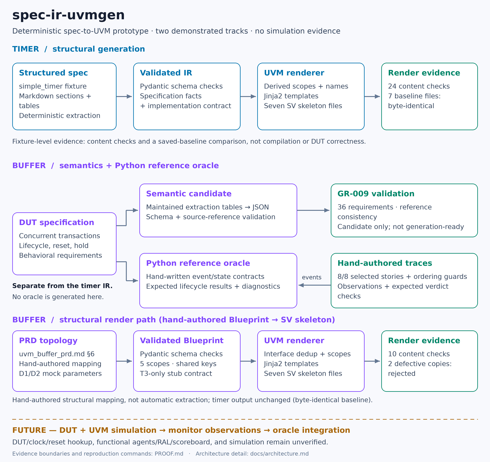

# spec-ir-uvmgen

**Revision:** 3.2 (2026-09-21 23:57 PDT)
**Status:** Initial public release.

A deterministic spec-to-UVM prototype for verification engineers exploring
validated intermediate representations and reproducible code generation.
The demonstrated generator converts the structured Markdown `simple_timer`
specification into a UVM SystemVerilog skeleton. A separate concurrent-buffer
prototype exercises a Python reference oracle against hand-authored traces.

## Current validation boundary

Converts a natural-language hardware spec into a validated intermediate representation, then generates a UVM verification environment from it. The IR and a Python reference oracle are proven — 8/8 hand-authored traces, byte-identical regeneration. The generated UVM has not yet been run in simulation; that's next.

The evidence below scopes these claims to the supplied fixtures and Python
checks, not formal proof or a completed hardware-verification flow.

## Architecture at a glance



Two related tracks share the spec-first methodology; they are not yet one
integrated generator/simulator/oracle pipeline:

```text
Timer:  structured spec → validated SemanticIR + implementation contract
                       → Jinja2 renderer → seven UVM SystemVerilog files

Buffer: DUT PRD → maintained semantic tables → candidate JSON → validation
        DUT PRD → Python event contracts + reference oracle
                ← eight hand-authored observation traces
```

The timer extractor owns specification facts. The renderer derives instance
names, configuration scopes, and implementation stubs. The buffer oracle owns
expected lifecycle results; it is hand-written Python, not generated from the
timer IR. See [Architecture](docs/architecture.md) for boundaries and file roles.

## Setup

Python **3.11** is the tested version. The commands below use a POSIX shell and
start at the repository root. Python dependencies are pinned in
[requirements.txt](requirements.txt); no LLM credentials or simulator are needed
for these demonstrations.

```bash
python3 -m venv venv
. venv/bin/activate
python3 -m pip install -r requirements.txt
```

## Quick start: spec → IR → UVM skeleton

Use a fresh temporary directory so the example does not overwrite tracked
fixtures or generated evidence:

```bash
DEMO_DIR="$(mktemp -d)"
python3 material_extracted/extract_blueprint.py my_hardware_spec.md \
  --out "$DEMO_DIR/timer.extracted.json"
python3 uvm_platform/verify_render.py "$DEMO_DIR/timer.extracted.json" \
  --out "$DEMO_DIR/uvm"
printf 'Inspect generated files in %s/uvm\n' "$DEMO_DIR"
```

Expected result: Blueprint validation succeeds, **seven SV files** are emitted,
and **24 content checks** pass. The output includes three interfaces, a package,
an environment, a base test, and `tb_top.sv`. These are structural checks, not
compilation or simulation. The parser expects the section/table structure of
[my_hardware_spec.md](my_hardware_spec.md); arbitrary prose is not a demonstrated
input format.

Output directories are disposable: rendering replaces generated SV files, and
the Phase A runner replaces its selected output directory. Do not point either
at valuable files. Temporary results remain available for inspection; Python may
also create ignored bytecode caches.

## Demonstrated results

| Check | Reported result | What it establishes |
| --- | --- | --- |
| Timer renderer | 24/24 content checks on each of two supplied Blueprint files | Expected timer files, names, scopes, and placeholders |
| Phase A IR split | Seven rendered files byte-identical to `generated_baseline/` | Fixture-level render regression across the IR split |
| Buffer oracle | 8/8 hand-authored stories, plus ordering guards | Selected legal and illegal lifecycle observations produce expected Python verdicts |
| Buffer semantic candidate | GR-009 PASS: 36 requirements, 6 observations, 16 invariants, 8 decisions, 10 gates | Schema and reference consistency; not generation readiness |

[PROOF.md](PROOF.md) provides commands, evidence locations, expected output, and
coverage limits. The byte comparison concerns the timer fixture; the eight
stories concern the separate buffer oracle.

## Limitations and next work

- **Generated UVM has not been compiled or simulated.** DUT/clock/reset
  integration, external agent implementations, and functional RAL/scoreboard
  behavior remain necessary. Several generated classes are placeholders.
- The eight oracle stories are a milestone subset, not complete DUT requirement
  coverage. Positive hold-violation and watchdog-firing coverage remains outside
  that milestone; see [PROOF.md](PROOF.md).
- The buffer semantic model remains `candidate_pending_human_approval` with
  `generation_ready: false`. Validation does not promote it.
- The LLM extraction path was removed. General arbitrary-spec extraction,
  integrated buffer UVM generation, multi-design generalization, and real
  multi-agent coordination are not demonstrated.
- Verification Intent IR and the generation manifest are deferred. Simulation
  and the connection between generated monitors and the Python oracle are future
  integration work, not an existing runnable command.

## Documentation and authority

- [Architecture](docs/architecture.md): implemented tracks and ownership.
- [Evidence and reproduction](PROOF.md): claims, commands, and limits.
- [Authoritative platform requirements](docs/extensible_uvm_platform_reqspec_v0_3.md):
  detailed architectural goals and open questions; Draft v0.3 is not a claim
  that all requirements are implemented.
- [Buffer DUT PRD](uvm_buffer_prd.md): authoritative buffer behavioral contract.
- [Semantic agreements](docs/AGREEMENTS.md) and [deferment log](docs/deferment.md):
  decisions and historical deferrals.
- [IR-split design note](material_extracted/design_ir_split.md),
  [FLOW](docs/FLOW.md), [CONTINUATION](docs/CONTINUATION.md), and
  [deprecated platform PRD](docs/prd.md): development history; older phase counts,
  commands, and session references are not current public quickstart guidance.

## License and attribution

[MIT License](LICENSE). spec-ir-uvmgen builds on ideas from the cited paper
HAVEN (arXiv:2604.27643); it is not a reproduction of that project's results.
