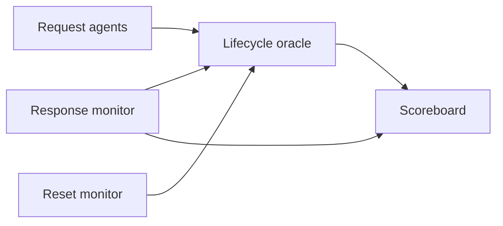

# Product Requirements Document (PRD) – Prototype v0.0e
## AI-Assisted UVM Verification Platform – Concurrent Transaction Lifecycle Prototype

| Field | Value |
| :--- | :--- |
| Project | UVM Framework Validation |
| Version | v0.0e |
| Status | Ready for Semantic Extraction – Six-Week Prototype |
| Core Objective | Prove that AI-assisted semantic extraction, human semantic closure, deterministic generation, and a generated UVM environment can verify a concurrent transaction lifecycle. |
| Release Target | Internal prototype; no production intent |

---

## 1. Project Intent

The DUT is a controlled concurrency vessel. The product is the methodology:

```text
Specification
  -> candidate semantic extraction
  -> human-approved semantic closure
  -> validated behavior model
  -> deterministic UVM generation
  -> compile and simulation evidence
```

Data integrity is one verification signal. Lifecycle, handshake, reset, duplication, and end-of-test invariants must also be checked directly.

### 1.1 Methodology Boundary

- The LLM may extract, structure, and propose semantic decisions.
- The LLM must not make unresolved behavioral decisions authoritative.
- Generated SystemVerilog is disposable and must not become a second specification.
- Only repeated, proven transformations are promoted into the generator.

### 1.2 Claims Boundary

The prototype proves the methodology for this DUT and the listed failure set. It does not claim general UVM correctness.

---

## 2. Scope

### 2.1 In Scope

- Behavioral, non-synthesizable shared transaction buffer.
- Two independent request sources.
- Shared finite capacity and backpressure.
- One rising-edge clock and one active-high synchronous reset.
- Request-side `hold` backpressure and response-side `valid/ready` flow control.
- Explicit transaction identity.
- Per-request completion eligibility delay from 1 through 8 cycles and out-of-order completion.
- Reset while transactions are outstanding.
- One request monitor per source and one response monitor.
- Associative lifecycle oracle and scoreboard.
- Small assertion set for protocol and reset behavior.
- Approved legal and illegal traces.
- Directed simulation plus limited constrained-random stress.
- JSON transaction and phase-event logging.

### 2.2 Out of Scope

- Banking, address swizzling, CAM state protocols, and per-bank queues.
- General verification-intent ontology or reusable scoreboard framework.
- Formal verification, CDC, synthesis, timing, area, and performance analysis.
- General trace DSL, multi-backend generation, and production evidence infrastructure.
- Broad functional coverage closure.
- Reads from addresses without an earlier completed write.

---

## 3. DUT Behavioral Contract

This section is normative. Implementation mapping and UVM terminology do not define DUT behavior.

### 3.1 Clock, Reset, Parameters, and Mock Defaults

The interface and behavior model retain symbolic parameters. The mock implementation uses the defaults below. A generator must preserve the parameter relationships and must not treat a mock default as an inferred semantic rule.

| Item | Direction / Kind | Structural Constraint | Mock Default | Semantics |
| :--- | :--- | :--- | :--- | :--- |
| `clk` | DUT input | 1 bit | — | All acceptance, completion, and reset state changes occur on `posedge clk` |
| `rst` | DUT input | 1 bit | — | Active-high synchronous reset; reset has priority over all handshakes |
| `MAX_CAPACITY` | Parameter | Fixed prototype requirement | 16 | Maximum number of outstanding transactions |
| `ID_W` | Parameter | `2**ID_W >= MAX_CAPACITY` | 8 | Transaction-ID namespace is independent of capacity |
| `ADDR_W` | Parameter | `ADDR_W >= 1` | 8 | Address width |
| `DATA_W` | Parameter | `DATA_W >= 1` | 32 | Read/write payload width |
| `OP_W` | Parameter | Must encode at least `READ` and `WRITE` | 1 | Operation width |
| `STATUS_W` | Parameter | Must encode `OK` | 1 | Response-status width |
| `DELAY_W` | Parameter | Must encode `MAX_COMPLETION_DELAY` | 4 | Per-request eligibility-delay width |
| `MIN_COMPLETION_DELAY` | Parameter | `>= 1` | 1 | Minimum legal `req_delay` |
| `MAX_COMPLETION_DELAY` | Parameter | `>= MIN_COMPLETION_DELAY` | 8 | Maximum legal `req_delay` |
| `WATCHDOG_CYCLES` | Parameter | Fixed at 256 for v0.0d | 256 | Maximum response-service-enabled cycles before liveness failure |

Mock encodings are `READ = 0`, `WRITE = 1`, and `OK = 0`. They belong to the mock implementation contract and must be recorded in the generation manifest.

### 3.2 Protocol Assumptions and Guarantees

#### Environment assumptions

| Assumption ID | Normative Rule |
| :--- | :--- |
| ENV-001 | A source must keep `req_valid[p]`, `req_id[p]`, `req_addr[p]`, `req_op[p]`, `req_wdata[p]`, and `req_delay[p]` stable while `req_valid[p] && req_hold[p]`. |
| ENV-002 | Stimulus must use `req_delay[p]` values from `MIN_COMPLETION_DELAY` through `MAX_COMPLETION_DELAY` inclusive. |
| ENV-003 | Stimulus must not present an ID that is already outstanding, including presenting the same new ID on both sources in one cycle. The request monitor and lifecycle oracle must report an accepted duplicate ID as an illegal-stimulus failure; DUT behavior after that protocol violation is unspecified. |
| ENV-004 | Stimulus must not issue a read to an address without an earlier completed write in the current reset epoch. |
| ENV-005 | Stimulus obeys `req_hold[p]` only; it must not track, model, or condition on occupancy. Unchecked by design — no interface-observable signal distinguishes compliant from non-compliant stimulus. |

#### DUT guarantees

| Requirement ID | Normative Rule |
| :--- | :--- |
| DUT-PROTO-001 | When `rsp_valid && !rsp_ready`, the DUT must keep `rsp_valid`, `rsp_id`, `rsp_rdata`, and `rsp_status` stable until completion or reset. |
| DUT-PROTO-002 | `rsp_status` must be `OK` for every legal completed transaction. All other status encodings are reserved and illegal for this prototype. |
| DUT-PROTO-003 | Reset overrides request acceptance and response completion. |
| DUT-PROTO-004 | When `req_hold[p]` is low at a rising clock edge and `req_valid[p]` is high, the request on source `p` is accepted at that edge, unconditionally and independent of the state of the other source. |

### 3.3 Request Channel

`req_hold[p]` is active-high backpressure. A source may assert `req_valid[p]` independently of `req_hold[p]`, but must retain its request while held.

| Signal | Direction | Width | Semantics |
| :--- | :--- | :--- | :--- |
| `req_valid[p]` | Input | 1 | Request is present on source `p` |
| `req_hold[p]` | Output | 1 | DUT prevents acceptance from source `p` when high |
| `req_id[p]` | Input | `ID_W` | Transaction identity |
| `req_addr[p]` | Input | `ADDR_W` | Transaction address |
| `req_op[p]` | Input | `OP_W` | `READ` or `WRITE` |
| `req_wdata[p]` | Input | `DATA_W` | Write payload; ignored for reads |
| `req_delay[p]` | Input | `DELAY_W` | Number of rising edges after acceptance before the transaction becomes completion-eligible |

### 3.4 Response Channel

The response channel uses ordinary valid/ready flow control. The DUT may present one response at a time.

| Signal | Direction | Width | Semantics |
| :--- | :--- | :--- | :--- |
| `rsp_valid` | Output | 1 | Response is present |
| `rsp_ready` | Input | 1 | Environment accepts the response |
| `rsp_id` | Output | `ID_W` | Identity of the completed request |
| `rsp_rdata` | Output | `DATA_W` | Read payload; ignored for writes |
| `rsp_status` | Output | `STATUS_W` | `OK` for every legal completion |

### 3.5 Transaction Lifecycle

| Requirement ID | Topic | Normative Rule |
| :--- | :--- | :--- |
| DUT-LC-001 | Request acceptance | A request is accepted on a rising clock edge when `req_valid[p] && !req_hold[p]`. |
| DUT-LC-002 | Response completion | A transaction completes on a rising clock edge when `rsp_valid && rsp_ready`. |
| DUT-LC-003 | Identity scope | `req_id` is globally unique while its transaction is outstanding. Duplicate-ID avoidance is an environment obligation checked by the verification environment. |
| DUT-LC-004 | ID reuse | An ID may be reused only after its prior transaction completes or is flushed by reset. |
| DUT-LC-005 | Capacity | Maximum outstanding transactions is 16. `occupancy_next = occupancy + accepted_request_count - completed_response_count`. |
| DUT-LC-006 | Backpressure | The DUT must not accept a request when doing so would exceed capacity. |
| DUT-LC-007 | Simultaneous acceptance | Both request sources are accepted when both are valid and at least two slots are free. |
| DUT-LC-009 | Completion order | Transactions may complete out of acceptance order. |
| DUT-LC-010 | Response rate | The single response channel completes at most one transaction per cycle. Back-to-back completions on consecutive cycles are permitted. |
| DUT-LC-011 | Pre-edge capacity rule | Request hold uses occupancy at the beginning of the edge. A completion on an edge does not make a slot available for request acceptance on that same edge. |
| DUT-LC-012 | Full backpressure | When pre-edge occupancy is 15 or more, `req_hold[1:0] == 2'b11`, including an edge on which a response completes. Depth remains 16; occupancy 16 is a transient cushion slot reachable only in the hold/accept race. |
| DUT-LC-013 | Single-request acceptance | When at least one slot is free and exactly one source is valid, that request is accepted. |
| DUT-LC-014 | Completion eligibility | A request accepted on edge `C` with delay `D` may complete no earlier than edge `C + D`, where `MIN_COMPLETION_DELAY <= D <= MAX_COMPLETION_DELAY`. |
| DUT-LC-015 | Completion selection | When multiple transactions are eligible and no response is already being held, the DUT may select any eligible transaction. Selection timing and order remain functionally flexible subject to the watchdog and response-rate rules. |

### 3.6 Data Semantics

| Requirement ID | Topic | Normative Rule |
| :--- | :--- | :--- |
| DUT-DATA-001 | Write visibility | A write updates the associative memory when the write transaction completes. |
| DUT-DATA-002 | Read value | A read returns the latest completed write data for its address as observed at the read completion event. |
| DUT-DATA-003 | Same-address ordering | Same-address visibility is determined by completion order, not acceptance order. |
| DUT-DATA-004 | Unwritten reads | Prototype stimulus must not issue reads to addresses without an earlier completed write in the current reset epoch. |

### 3.7 Reset Semantics

| Requirement ID | Topic | Normative Rule |
| :--- | :--- | :--- |
| DUT-RST-001 | Outstanding transactions | The first reset edge flushes all outstanding transactions, clears occupancy, cancels completion eligibility and watchdog state, and advances the reset epoch once. State remains clear on later edges while reset is held. |
| DUT-RST-002 | Stale responses | A response belonging to a pre-reset transaction must not be presented or accepted after reset release. |
| DUT-RST-003 | ID reuse after reset | IDs from flushed transactions may be reused beginning with the first operational edge after reset release. |
| DUT-RST-004 | Reset sampling | Reset is sampled on `posedge clk`. When `rst == 1`, reset is the only state transition performed on that edge. The reset epoch advances only on the first edge that samples `rst == 1` after an operational edge. |
| DUT-RST-005 | Memory state | Reset clears the DUT associative memory and the oracle golden memory. An address is unwritten again in the new epoch. |
| DUT-RST-006 | Channel behavior | On an edge that samples `rst == 1`, no request or response handshake occurs regardless of the pre-edge channel values. Following that edge and while reset remains asserted, `req_hold[1:0] == 2'b11` and `rsp_valid == 1'b0`. |
| DUT-RST-007 | Reset release | Normal operation resumes on the first rising edge for which `rst == 0`. |

### 3.8 Liveness

The oracle maintains a global response-service counter. It increments on each rising edge for which `rst == 0 && rsp_ready == 1`. Each accepted transaction records the counter value at acceptance.

| Requirement ID | Topic | Normative Rule |
| :--- | :--- | :--- |
| DUT-LIVE-001 | Completion progress | Every accepted transaction must complete while reset is inactive and response service remains enabled. |
| DUT-LIVE-002 | Simulation bound | A transaction must complete within 256 response-service-enabled cycles after acceptance. Cycles with `rst == 1` or `rsp_ready == 0` do not advance the watchdog. Reset cancels the transaction and its watchdog. |

---

## 4. Semantic Closure Decisions

| Decision ID | Topic | Status | Disposition |
| :--- | :--- | :--- | :--- |
| OD-001 | Completion watchdog | Closed | 256 response-service-enabled cycles |
| OD-002 | Same-edge capacity | Closed | Hold uses pre-edge occupancy; same-edge completion does not free an acceptance slot |
| OD-003 | Duplicate request ID | Closed | Environment obligation; accepted violation is reported by monitor/oracle and DUT behavior is then unspecified |
| OD-004 | Reset | Closed | One `clk`; active-high synchronous `rst`; reset dominates handshakes and clears behavioral DUT/oracle state; verification-only flushed-ID history may persist for stale-response classification |
| OD-005 | Stale-response observability | Closed | A stale-response mutation must reserve the flushed ID until the injected stale response is observed |
| OD-006 | Completion delay | Closed | Stimulus supplies a per-request eligibility delay bounded by symbolic parameters; mock defaults are 1 through 8 cycles |
| OD-007 | Response status | Closed | Legal responses use `OK`; the mock encoding is zero and no DUT error response is modeled |
| OD-008 | Oracle/scoreboard ownership | Closed | Oracle solely owns semantic state and expected-result production; scoreboard pairs actual and expected records and owns comparison reporting |

Generation must stop if a future open decision blocks the selected output.

---

## 5. Verification Intent

### 5.1 Required Observations

| Observation ID | Event | Required Fields |
| :--- | :--- | :--- |
| OBS-001 | Request accepted | cycle, source, ID, address, operation, write data, requested delay |
| OBS-002 | Response completed | observation sequence, cycle, ID, read data, status |
| OBS-003 | Reset transition | cycle, asserted/deasserted state |
| OBS-004 | Test termination request | cycle, outstanding count, reset epoch |
| OBS-005 | Protocol violation | cycle, source/channel, violated rule, ID-valid flag, relevant transaction ID |

Interface monitors publish observed interface facts only. The oracle is the sole producer of derived `reset_epoch`, `service_counter`, expected values, and lifecycle classification.

#### 5.1.1 Observation Field Contract

| Field | Producer / Source | Model Type | Meaning |
| :--- | :--- | :--- | :--- |
| `cycle` | Producing monitor or test | `longint unsigned` | Rising-edge count within the simulation run |
| `observation_seq` | Response monitor | `longint unsigned` | Unique monotonically increasing key for each completed-response observation |
| `source` | Request monitor | `bit` | Request source 0 or 1 |
| `id` | Sampled DUT interface | `bit [ID_W-1:0]` | Transaction ID |
| `addr` | Sampled DUT interface | `bit [ADDR_W-1:0]` | Transaction address |
| `operation` | Sampled DUT interface | `bit [OP_W-1:0]` | `READ` or `WRITE` |
| `write_data` | Sampled DUT interface | `bit [DATA_W-1:0]` | Accepted write payload; ignored for reads |
| `requested_delay` | Sampled DUT interface | `bit [DELAY_W-1:0]` | Accepted completion-eligibility delay |
| `read_data` | Sampled DUT interface | `bit [DATA_W-1:0]` | Completed read payload; ignored for writes |
| `status` | Sampled DUT interface | `bit [STATUS_W-1:0]` | Completed response status |
| `reset_state` | Reset monitor | `bit` | Sampled asserted or deasserted reset state |
| `reset_epoch` | Oracle | `int unsigned` | Verification generation advanced once per reset assertion |
| `service_counter` | Oracle | `longint unsigned` | Count of response-service-enabled cycles |
| `outstanding_count` | Oracle | `int unsigned` constrained to 0 through `MAX_CAPACITY` | Number of currently outstanding transactions |
| `violation_channel` | Protocol checker | Enum `{REQ0, REQ1, RSP, RESET, TEST}` | Interface or control domain reporting a violation |
| `violated_rule` | Protocol checker | `string` | Stable requirement or invariant ID |
| `id_valid` | Protocol checker | `bit` | Indicates whether the violation has a relevant transaction ID |

#### 5.1.2 Oracle-Result Contract

The oracle publishes one result for every `OBS-002`, including lifecycle-invalid responses.

| Field | Model Type | Meaning |
| :--- | :--- | :--- |
| `observation_seq` | `longint unsigned` | Pairing key copied from `OBS-002` |
| `reset_epoch` | `int unsigned` | Oracle epoch in which the response was observed |
| `service_counter` | `longint unsigned` | Oracle service-counter value at response observation |
| `lifecycle_valid` | `bit` | The response legally matches one outstanding transaction |
| `error_code` | Enum `{NONE, UNKNOWN_ID, DUPLICATE_COMPLETION, STALE_RESPONSE}` | Lifecycle disposition |
| `matched_request_valid` | `bit` | Indicates whether a matching accepted-request observation is present |
| `matched_request` | `OBS-001` record | Accepted request associated with the response |
| `compare_read_data` | `bit` | Enables read-data comparison for a completed read |
| `expected_read_data` | `bit [DATA_W-1:0]` | Expected completed-read payload |
| `expected_status` | `bit [STATUS_W-1:0]` | Expected response status |

### 5.2 Checker Responsibilities

| Concern | Primary Mechanism |
| :--- | :--- |
| Request hold stability and response stall stability | Monitors and assertions |
| Outstanding lifecycle | Associative oracle |
| Expected response identity, data, and status | Lifecycle oracle |
| Actual-versus-expected comparison and reporting | Scoreboard |
| Capacity | Oracle invariant plus assertion |
| Reset flushing | Reset monitor plus oracle transition |
| Bounded completion | Watchdog or assertion |
| Test completion | Test-owned objection plus zero-outstanding guard |

The response monitor assigns a monotonically increasing `observation_seq` to every completed-response observation and broadcasts the same observation to the oracle and scoreboard.

The oracle is the sole owner of `outstanding_table`, occupancy, reset epoch, service counter, watchdog state, `golden_mem`, `completed_id_set`, and `flushed_id_set`. The two ID-history sets are verification-only classification state, not DUT behavioral state.

The oracle receives a read-only virtual-interface handle for `clk`, `rst`, and `rsp_ready` solely to advance the service counter and watchdog. Transaction identity and payload enter the oracle only through monitor observations.

- On a legal completion, the oracle removes the ID from `outstanding_table` and records it in `completed_id_set`.
- On reset, the oracle records flushed outstanding IDs in `flushed_id_set`, clears behavioral state, and starts a new epoch.
- On legal ID reuse, the oracle removes that ID from the applicable history set before creating the new outstanding entry.
- Duplicate-completion and stale-response mutation tests must reserve the affected ID until the injected response is observed; otherwise the response interface cannot distinguish the old transaction from a legal reused ID.

The oracle consumes accepted-request and raw reset-transition observations. It advances `reset_epoch` on an asserted transition and records its current epoch and service-counter value in each new outstanding entry. For each completed-response observation, it resolves the outstanding request, computes the expected response, updates semantic state only when the lifecycle event is valid, and publishes one oracle-result transaction containing `observation_seq`, current epoch and service counter, lifecycle-valid status, matched request when available, and expected data and status.

The scoreboard receives both the actual response observation and oracle-result transaction. It buffers either arrival until both records with the same `observation_seq` are available, compares actual and expected fields, records lifecycle and value mismatches, and produces summary status. It must not maintain a second outstanding table or golden memory. The scoreboard does not own normal phase objections and does not attempt to block phase jumps.

### 5.3 Required Invariants

| Invariant ID | Rule |
| :--- | :--- |
| INV-001 | Every accepted transaction creates exactly one outstanding entry. |
| INV-002 | Every completed response matches one outstanding transaction. |
| INV-003 | Duplicate and unknown completions fail. |
| INV-004 | Occupancy remains between zero and 16. |
| INV-005 | Reset removes all outstanding entries and advances the reset epoch. |
| INV-006 | A stale pre-reset response fails if observed after reset deassertion. |
| INV-007 | Normal test termination requires zero outstanding transactions. |
| INV-008 | Read response data follows DUT-DATA-001 through DUT-DATA-004. |
| INV-009 | `occupancy == outstanding_table.size()` after every processed edge. |
| INV-010 | Request fields remain stable while `req_valid[p] && req_hold[p]`. |
| INV-011 | Response fields remain stable while `rsp_valid && !rsp_ready`. |
| INV-012 | Every legal completed response has `rsp_status == OK`. |
| INV-013 | No transaction exceeds 256 response-service-enabled cycles while outstanding. |
| INV-014 | No request or response handshake occurs while reset is asserted. |
| INV-015 | Every completed-response observation produces exactly one oracle-result transaction, and the scoreboard compares exactly one actual/expected pair with the same `observation_seq`. |

### 5.4 Required Mutations

The prototype must detect at least three deliberate faults selected from:

- duplicate completion;
- unknown completion;
- corrupted response data;
- stale response after reset;
- premature test objection drop;
- monitor event emitted before the interface handshake;
- response payload changed while stalled;
- request payload changed while held;
- watchdog expiration.

For duplicate-completion and stale-response mutations, the affected transaction ID must not be reused until the injected response has been observed. This makes the fault externally distinguishable without adding a generation or epoch field to the DUT response interface.

### 5.5 Requirement Traceability

| Requirement | Observation | Checker / Invariant | Primary Test |
| :--- | :--- | :--- | :--- |
| DUT-LC-001, DUT-LC-002 | OBS-001, OBS-002 | INV-001, INV-002 | LT-001 |
| ENV-001 through ENV-004 | OBS-001, OBS-005 | Protocol/stimulus checker, INV-010 | LT-010, IT-004, IT-009, IT-011 |
| ENV-005 | OBS-001 | unchecked by design — no checker mapping required | — |
| DUT-PROTO-001 through DUT-PROTO-003 | OBS-002, OBS-003, OBS-005 | INV-011, INV-012, INV-014 | LT-011, IT-010, IT-012 |
| DUT-PROTO-004 | OBS-006 | INV-016, capacity checker | LT-012 |
| DUT-LC-003, DUT-LC-004 | OBS-001, OBS-002, OBS-005 | INV-001, protocol checker | LT-004, IT-004 |
| DUT-LC-005 through DUT-LC-007, DUT-LC-011 through DUT-LC-013 | OBS-001, OBS-002 | INV-004, INV-009, capacity assertion | LT-002, LT-012, LT-013, IT-003 |
| DUT-LC-009, DUT-LC-010, DUT-LC-014, DUT-LC-015 | OBS-001, OBS-002 | Oracle eligibility model, response-rate assertion | LT-001, LT-006, LT-014 |
| DUT-DATA-001 through DUT-DATA-004 | OBS-001, OBS-002 | INV-008 | LT-007, LT-008, IT-005 |
| DUT-RST-001, DUT-RST-004 through DUT-RST-007 | OBS-003 | INV-005, INV-014 | LT-005 |
| DUT-RST-002, DUT-RST-003 | OBS-001, OBS-002, OBS-003 | INV-006 | LT-005, IT-006 |
| DUT-LIVE-001, DUT-LIVE-002 | OBS-001, OBS-002, OBS-003 | INV-013 | LT-009, IT-008 |
| Oracle/scoreboard response pairing | OBS-002 | INV-015 | LT-001, IT-001, IT-002 |

---

## 6. UVM Implementation Mapping



| Component | Prototype Responsibility |
| :--- | :--- |
| Request agents 0 and 1 | Drive request channels and publish accepted-request observations |
| Response monitor | Assign `observation_seq` and broadcast completed-response observations to both oracle and scoreboard |
| Reset monitor | Publish raw asserted/deasserted reset transitions; own no epoch or lifecycle state |
| Lifecycle oracle | Use a read-only `clk/rst/rsp_ready` virtual-interface view for timekeeping; solely own outstanding transactions, occupancy, reset epoch, service counter, deadlines, golden memory, verification-only completed/flushed ID history, and expected-response calculation; publish one oracle-result transaction per completed response |
| Scoreboard | Pair actual response observations with oracle results by `observation_seq`, compare fields, report identity/payload/status/lifecycle failures, and accumulate test summary; own no duplicate semantic state |
| Test | Own objections, stimulus, drain policy, and final zero-outstanding check |

The first UVM mapping may be partially hand-authored. Only stable repeated transformations are moved into the renderer.

---

## 7. Test Plan

### 7.1 Approved Legal Traces

| Trace ID | Scenario | Expected Result |
| :--- | :--- | :--- |
| LT-001 | Two accepted requests complete in reverse order | Pass |
| LT-002 | Both request sources accept in one cycle while `req_hold` is low on both | Pass |
| LT-004 | Legal ID reuse after prior completion | Pass |
| LT-005 | Synchronous reset with outstanding transactions | Outstanding and memory state are flushed; IDs may be reused after reset |
| LT-006 | Transactions with delays at the configured minimum and maximum become eligible independently and complete out of acceptance order | Pass |
| LT-007 | Completed write followed by read of the same address | Read returns completed write data |
| LT-008 | Same-address transactions complete in a different order from acceptance | Visibility follows completion order |
| LT-009 | Transaction completes at or before the 256th response-service-enabled cycle | Pass |
| LT-010 | Request remains stable across multiple held cycles | Pass |
| LT-011 | Response remains stable across multiple cycles with `rsp_ready == 0` and later completes | Pass |
| LT-012 | At full occupancy, a response completes while a request is valid on the same edge | Response completes, request remains held, and next occupancy is 15 |
| LT-013 | Exactly one source is valid while `req_hold[p]` is low | The valid request is accepted |
| LT-014 | Two responses complete on consecutive rising edges | Pass |

### 7.2 Approved Illegal Traces

| Trace ID | Scenario | Expected Result |
| :--- | :--- | :--- |
| IT-001 | Completion for an unknown ID | Fail |
| IT-002 | Duplicate completion | Fail |
| IT-003 | Acceptance beyond capacity | Fail |
| IT-004 | ID reuse while still outstanding | Fail |
| IT-005 | Response payload mismatch | Fail |
| IT-006 | Pre-reset response observed after reset deassertion | Fail |
| IT-007 | Test termination with outstanding transactions | Fail |
| IT-008 | Outstanding transaction exceeds 256 response-service-enabled cycles | Fail |
| IT-009 | Request fields change while `req_valid && req_hold` | Fail |
| IT-010 | Response ID, data, status, or valid changes while stalled | Fail |
| IT-011 | Request uses delay outside the configured minimum/maximum range | Illegal stimulus failure |
| IT-012 | Legal completion reports a status other than `OK` | Fail |

### 7.3 Constrained-Random Stress

Randomize request source, operation, previously written address, request delay within the configured range, response backpressure, and reset timing. The mock defaults use delays from 1 through 8. Log the seed, PRD revision, approved semantic-model revision, and implementation manifest revision.

---

## 8. Deliverables and Exit Criteria

### 8.1 Deliverables

- `dut.sv`
- approved semantic-closure table
- validated behavior-model artifact
- machine-valid semantic schema and semantic-model instance
- generated or mapped UVM agents, monitors, oracle, scoreboard, assertions, environment, and tests
- legal and illegal trace suite
- simulator run scripts
- JSON event log
- small generation manifest recording revisions and validation status

### 8.2 Exit Criteria

- The behavior model contains no unresolved blocking decisions.
- The semantic-model instance validates against the semantic schema.
- Every normative DUT requirement is mapped to an observation, checker or invariant, and primary test.
- Approved legal traces pass and approved illegal traces fail.
- Generated UVM compiles and runs in a real simulator.
- Reverse-order completion passes.
- Duplicate, unknown, stale-reset, and corrupted responses are detected.
- Zero-outstanding state is enforced at normal test termination.
- At least three deliberate checker or synchronization mutations are detected.
- Generation is reproducible from the approved semantic representation.
- A clean run records simulator identity, seed, PRD revision, semantic-model revision, and generation-manifest revision.

### 8.3 Generation-Readiness Gate

The generator must not repair, infer, or silently default missing structural or architectural decisions. UVM generation may begin only when all applicable gate items pass.

| Gate ID | Required Condition |
| :--- | :--- |
| GR-001 | Every generated interface signal has a declared direction, width constraint, and meaning; every generated transaction field has a declared producer, model type, and meaning. |
| GR-002 | Every semantic state transition has an observable trigger and defined state effect. |
| GR-003 | Every generated component has one explicit responsibility and every authoritative state object has exactly one owner. |
| GR-004 | Simultaneous-edge behavior is deterministic or explicitly identified as permitted nondeterminism. (v0.0e: all simultaneous-edge behavior is deterministic; final-slot arbitration was removed with the symmetric-hold rework.) |
| GR-005 | Environment assumptions, DUT guarantees, mock defaults, and verification-only constraints remain distinguishable. |
| GR-006 | Every normative requirement maps to an observation and checker, invariant, or assertion. |
| GR-007 | Existing requirement IDs remain stable; new behavior receives new IDs. |
| GR-008 | No blocking semantic-closure decision remains open. |
| GR-009 | The semantic-model instance validates against its schema and contains no unresolved references. |
| GR-010 | The generation manifest records every mock parameter, encoding, source revision, and generator revision used for the build. |

This PRD is eligible for candidate semantic extraction when GR-001 through GR-008 pass. Deterministic UVM generation remains blocked until GR-009 and GR-010 also pass.

GR-006 exemption: ENV-005 is unchecked by design — no interface-observable signal distinguishes compliant from non-compliant stimulus. It is recorded with `verification_status: unchecked_by_design` and requires no checker, invariant, or assertion mapping.

---

## 9. Revision History

| Date | Time | Version | Author | Changes |
| :--- | :--- | :--- | :--- | :--- |
| 2026-07-25 | Unknown | v0.0a | System Architect | Initial topology and synchronization stress-test draft. |
| 2026-07-25 | 12:38 | v0.0b | Chief Engineer | Reduced DUT complexity; separated direct synchronization checks from data integrity; defined request/response lifecycle, identity, completion, reset, and scope boundaries; replaced phase-jump test with end-of-test lifecycle guard. |
| 2026-07-26 | 00:55 | v0.0c | Chief Engineer | Reorganized the PRD into project intent, normative DUT behavior, open decisions, verification intent, UVM mapping, tests, and exit criteria; added stable requirement IDs and symbolic interface widths for deterministic extraction. |
| 2026-07-30 | Unknown | v0.0d | Chief Engineer | Closed prototype semantic decisions; retained stable v0.0c requirement IDs; fixed the watchdog at 256 response-service-enabled cycles; defined single-clock synchronous reset, request hold backpressure, valid/ready response flow control, symbolic parameters with mock defaults, per-request delay, same-edge capacity behavior, back-to-back responses, separate oracle/scoreboard ownership and response pairing, protocol stability, stale-response observability, requirement traceability, and the generation-readiness gate. |
| 2026-08-30 | 22:56 | v0.0e | Chief Engineer | Symmetric-hold rework: removed DUT-LC-008 final-slot arbitration; moved the DUT-LC-012 hold threshold to pre-edge occupancy 15 (depth 16, cushion slot); added DUT-PROTO-004 hold-acceptance guarantee and ENV-005 depth-blind stimulus (unchecked by design, exempt from the GR-006 mapping gate); deleted LT-003; reworded LT-002 and LT-013 in hold terms; added INV-016 with the OBS-006 EdgeSample observation and the hold-violation record. |
